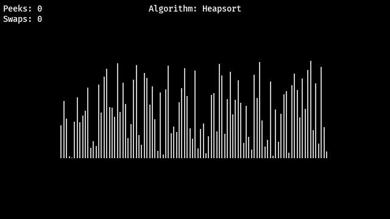

# Sortware

Sortware is a software developed by Isidor Nygren.
It is intended to be used for testing sorting algorithms and presenting visual
feedback on sorting algorithms.
"inspired" by [15 sorting algorithms in 6 minutes](https://www.youtube.com/watch?v=kPRA0W1kECg&t=29s).
## How-to
* Make sure you have python 3 installed.
* Install the requirements `pip install -r requirements.txt`
## Run
```
$ python sorter.py -h
usage: sorter.py [-h] [-m] [-s SORTER] [-dt DELTATIME]

Visualises sorting data with different algorithms

optional arguments:
  -h, --help            show this help message and exit
  -m, --mute            Mutes the application.
  -s SORTER, --sorter SORTER
                        Choose a sorting algorithm from the algorithm folder
                        (default:quicksort)
  -dt DELTATIME, --deltatime DELTATIME
                        The time between each swap (default:0.001)
```
Upon running the application you are presented with a window with unsorted rectangles.
To sort them, press the left mouse button inside of the window. When the sorting is complete,
press the left mouse button again to sort some more.
